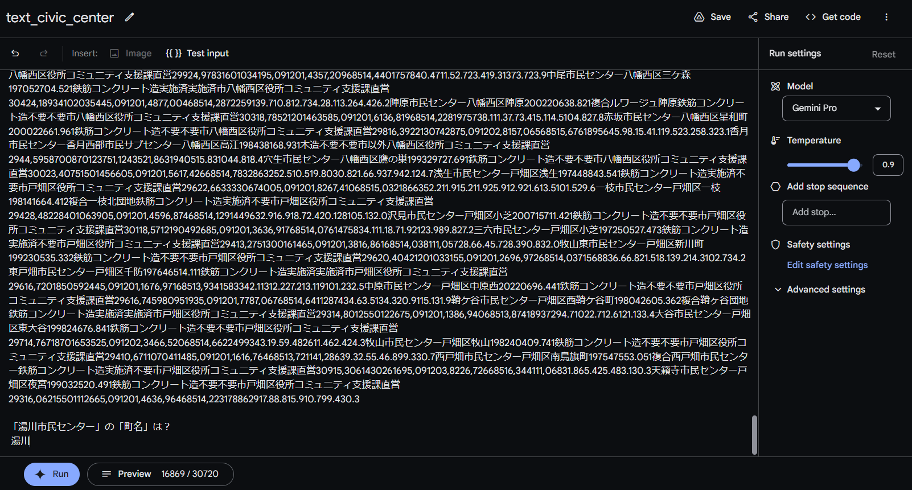

# Gemini Pro

## 概要
GeminiはGoogleが2023年12月に発表した大規模言語モデル(LLM)です。以下の3種類のサイズがあります。  
詳細は[Introducing Gemini: our largest and most capable AI model](https://blog.google/technology/ai/google-gemini-ai/#introducing-gemini)を確認ください。
- **Gemini Ultra** — 非常に複雑なタスクに対応する、最大かつ最も有能なモデル。
- **Gemini Pro** — 幅広いタスクに対応するための最良のモデル。
- **Gemini Nano** — オンデバイス タスク向けの最も効率的なモデル。

> [!NOTE]
> 現在使用可能なのは、**Gemini Pro**と**Gemini Nano**です。ただし、**Gemini Nano**はスマートフォン上で動作するLLMです。

## 料金

 Gemini APIの利用は、現在1分間に最大60回の呼び出しが可能で、以下の料金が適用されます。  
 最新の料金情報については、[利用料金](https://blog.google/technology/ai/gemini-api-developers-cloud/)を確認ください。

| タイプ                  | INPUT                 | OUTPUT                   |
|-------------------------|---------------------------|---------------------------|
| **テキスト入力**        | $0.00025 / 1K characters        | $0.0005 / 1K characters         |
| **画像入力**            | $0.0025 / image            |                       |

> [!CAUTION]
> 現在、Gemini APIは、無料で利用できます（2024/01/01現在）。無料期間終了後に上記料金が適用されます。

## 利用
Gemini Proは、Google Colab及びGoogle AI Studioで利用可能です。

### Google Colab での Gemini Pro 利用ガイド

以下の方法を参考にしてください。

1. [Google Colab で Gemini Pro をもっと試す](https://note.com/npaka/n/n1c368639cada)：このガイドを参照して、[notebook](notebook/Gemini%20Pro.ipynb)を作成。
2. [Python Quickstart](https://colab.research.google.com/github/google/generative-ai-docs/blob/main/site/en/tutorials/python_quickstart.ipynb#scrollTo=lEXQ3OwKIa-O)：Googleが提供するチュートリアルを実行して、Gemini Proが利用可能です。

> [!TIP]
> API keyは[Google AI Studio](https://makersuite.google.com/app/apikey)から取得できます。

### Google AI Studio での Gemini Pro 利用ガイド
[Google AI Studio](https://makersuite.google.com/)からGemini Proが利用できます。  
以下が実行イメージです。Google AI Studioは、notebookよりさらに環境構築に手間がかからないイメージです。  

#### Gemini Proによるテキスト読み込み
[jcommonsenseqa](https://github.com/yahoojapan/JGLUE/blob/c35b43c73056f6898837de0dcc5ba11cc7dc3ecc/datasets/jcommonsenseqa-v1.1/valid-v1.1.json#L125C6-L125C6)と[elyza/ELYZA-tasks-100](https://huggingface.co/datasets/elyza/ELYZA-tasks-100)を読み込み。質問に対して的確に答えています。  

### Gemini Pro Visionによる画像読み込み

#### 画像読み込み(1)：自然の風景

Gemini Pro Visionは、フリー素材の写真を読み込んで、木があることや雪が降っていることを的確に説明しました。

#### 画像読み込み(2)：AED設置施設一覧の解析

Gemini Pro Visionを使用して、[AED設置施設一覧(門司区)](https://www.city.kitakyushu.lg.jp/files/001024483.pdf)のPDFから画像データを読み込みました。テーブルのズレや数値の読み間違いがあるものの、重要な情報の抽出に成功しています。

読み込んだテーブルデータ

> [!TIP]
> Gemini ProとGemini Pro Visionのモデルは、画面右側のモデル選択で切り替え可能です。

## データ抽出
[北九州市公共施設白書（令和４年度状況）](https://www.city.kitakyushu.lg.jp/files/001058942.pdf)のデータを正しく抽出できるのかを確認。  
データをテキストデータとして**Gemini Pro**、画像データとして**Gemini Pro Vision**へプロンプトとして与えた。
> [!NOTE]
> **Gemini Pro Vision**はデータのスクリーンショットをプロンプトとして与えています。  
> データ全てのスクリーンショットを1度で撮れないため、読み込む行列を絞っている形になっています。

### 市営住宅に関するデータ抽出

#### Google AI Studio (Gemini Pro) での結果

新松崎団地の区名を聞いたところ、適切に「門司港」と回答。

> [!NOTE]
> 以下の画像は、Gemini Proによる回答のスクリーンショットです。テーブルデータに関して、ある程度内容を理解していることがわかります。

#### Google AI Studio (Gemini Pro Vision)
新松崎団地の区名を聞いたところ、適切に「門司港」と回答。

> [!NOTE]
> 以下の画像は、Gemini Pro Visionによる回答のスクリーンショットです。読み込むテーブルの行列の数を増やすと、新松崎を新松戸と間違えたりすることからテキストに比べると精度が落ちます。

### 市民センターに関するデータ抽出
#### Google AI Studio (Gemini Pro)
湯川市民センターの町名を聞いたところ、適切に「湯川」と回答。

> [!NOTE]
> 以下の画像は、Gemini Proによる回答のスクリーンショットです。テーブルデータに関して、ある程度内容を理解していることがわかります。

#### Google AI Studio (Gemini Pro Vision)
湯川市民センターの町名を聞いたところ、適切に「湯川」と回答。

> [!NOTE]
> 以下の画像は、Gemini Pro Visionによる回答のスクリーンショットです。湯川という文字が読み込みやすいためか、読み込むテーブルの行列の数を増やしても、ただしくテーブルの読み込みができました。

### 環境施設に関するデータ抽出
#### Google AI Studio (Gemini Pro)
北九州市エコタウンセンターの所管課を聞いたところ、適切に「環境イノベーション支援課」と回答。

> [!NOTE]
> 以下の画像は、Gemini Proによる回答のスクリーンショットです。テーブルデータに関して、ある程度内容を理解していることがわかります。

#### Google AI Studio (Gemini Pro Vision)
北九州市エコタウンセンターの所管課を聞いたところ、誤って「環境局環境政策課」と回答。

> [!NOTE]
> 以下の画像は、Gemini Pro Visionによる回答のスクリーンショットです。所管課の表示がセル内に収まっておらず、見切れていることが原因で読み込みが失敗していると考えられます

## その他参考資料
- [Build with Gemini](https://ai.google.dev/)
- [It’s time for developers and enterprises to build with Gemini Pro](https://blog.google/technology/ai/gemini-api-developers-cloud/)
