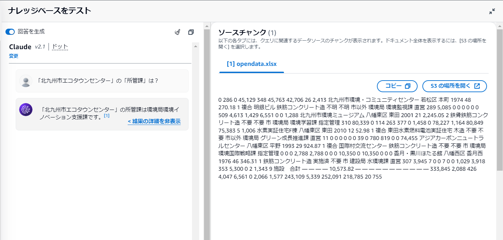

# AWS Bedrock Knowledge base

Claude2について、Knowledge baseを使用し、RAGを実行。  
北九州市のデータについて該当する部分のシート(市営住宅、市民センター、環境施設)をS3に登録し、それをベクトル化。  
コードを書く必要がなく簡単にRAGを構築可能。

**参考資料1**: [Amazon BedrockのKnowledge baseで簡単にRAGを構築](https://acro-engineer.hatenablog.com/entry/2023/12/20/140000)  
**参考資料2**: [外部バックアップ用にAmazon S3のバケットを設定する方法](https://kinsta.com/jp/knowledgebase/amazon-s3-backups/)

> [!NOTE]
> RAGを実行した際に、回答の根拠となる部分のチャンクも表示できます。

### 市営住宅に関するデータ抽出
新松崎団地の区名を聞いたところ、適切に「門司区」と回答。  

### 市民センターに関するデータ抽出
湯川市民センターの町名を聞いたところ、「町名」を答えることができませんでした。  

### 環境施設に関するデータ抽出
北九州市エコタウンセンターの所管課を聞いたところ、適切に「環境イノベーション支援課」と回答。  

